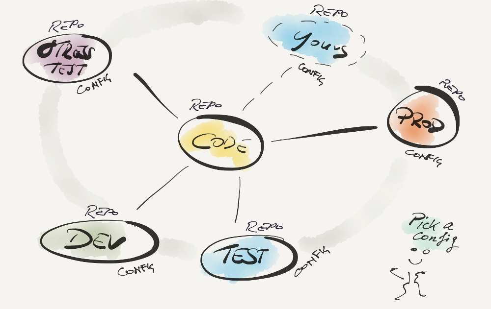
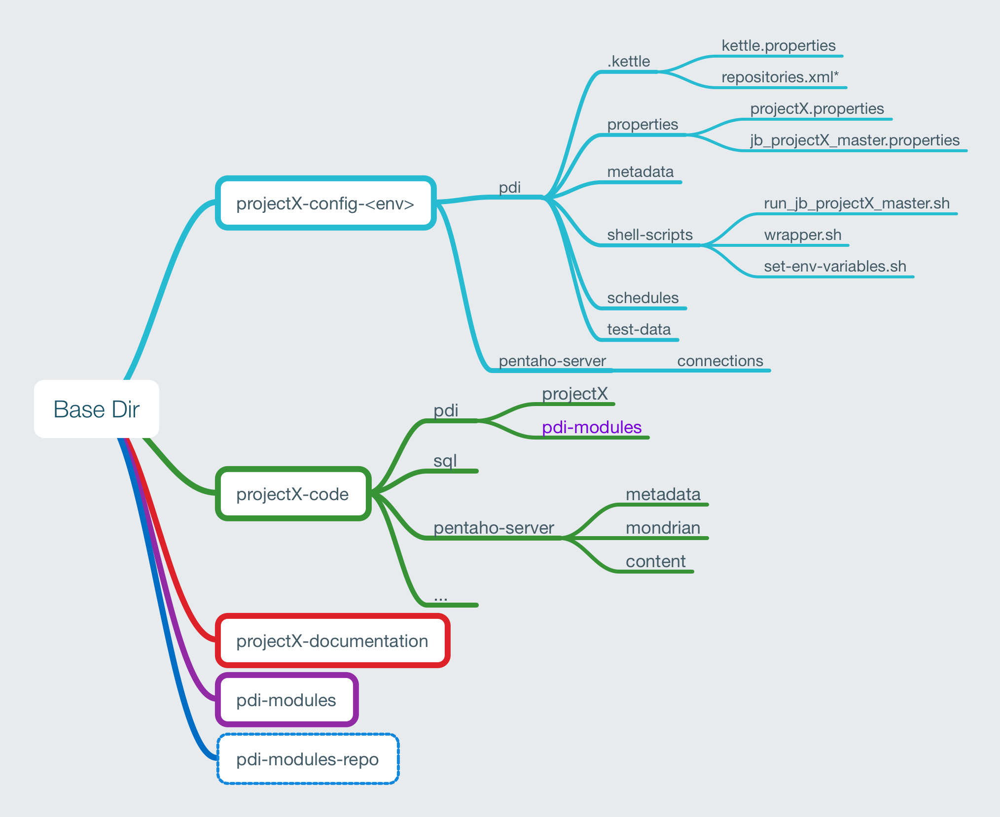
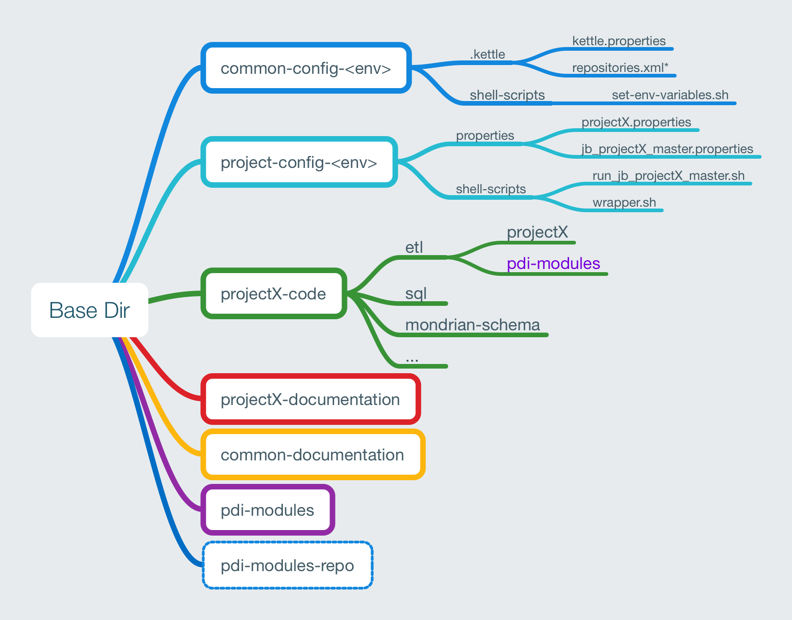
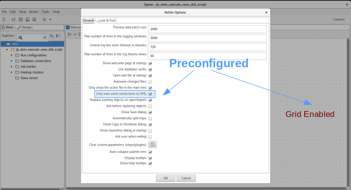
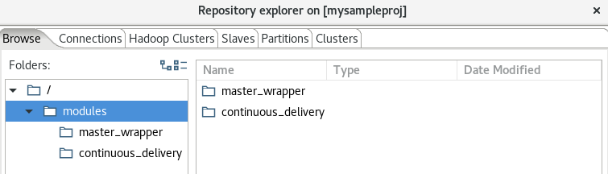
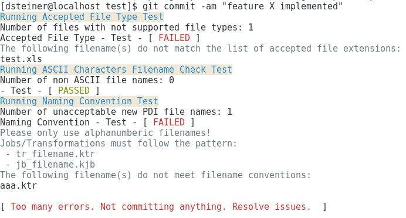
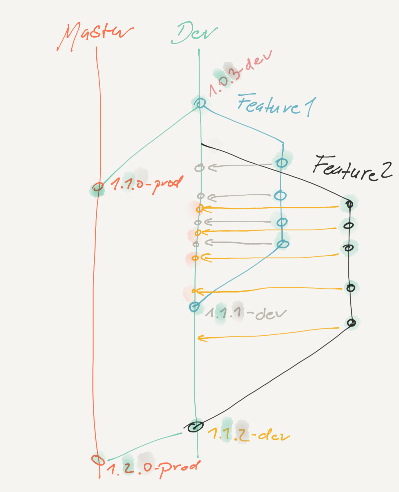

- **Title**: Pentaho Standardised Git Repository Setup
- **Author**: Diethard Steiner
- **Version**: 0.1

**Table of Contents**

[[toc]]

# Working Environment

- **Big** Organisation
- **Multiple**, possibly disconnected developer **teams**
- Loads of different projects

> Each team possibly defines their own standards, but what about global standards?

# Challenges

- **Standards** are **boring** ... 
- Teams don't **talk** to each other
- The usual PDI developer is **not a programmer**. **Version Control System** (Git) is often an unfamiliar concept.
- Extremely tight schedules: **Just get the job done!**

## Total Chaos?

- **Inconsistent usage of branches**. *Team A* uses `master` branch for development and *Team B* uses it for the prod-ready code. Which one to deploy?
- Different **file name conventions** being used or none at all.
- Whole lot of **file types** committed to the Git repository that shouldn't be there in the first place.
- Hard coded **configuration details**.
- Code can't run easily in environment X because setup is not flexible enough
- Difficult to identify **main job** due to lack of consistent naming across projects.
- Teams will **develop code over and over again**. 
- On deployment, not all required tables are created automatically

## My world - their world


## Think of ... deploying

- an automated process (**DevOps**) has to be able to pick up your code and deploy it
- this requires **standards**
- this requires strict **separation** of **code** and **configuration**: In prod config details might be supplied differently then in dev. 

## Think of ... supporting

Think of the one who has to monitor and support your projects! 

- They shouldn't have to consult a **100 page project-specific handbook** to keep your process alive.
- They **monitor 100 other projects**. 
- **Consistency is key!**

# What we are aiming for

**ENFORCE**:

- **standardised git folder structure** setup
- **naming conventions** (to some extend)

**ENABLE**: 

- **easy configuration** of **multiple environments** (but not necessarily production)
- running **multiple projects next to each other** with the same OS user
- **Simulation of multiple environments** on one machine within one user account
- **sharing of artefacts** across multiple projects (PDI and config)

No software dependencies: We are cut off from the world

# Artefacts

## PDI Store Types

- File based
- File Repo
- DB Repo
- Pentaho Repository (Jackrabbit based, CE and EE)


## PDI Artefacts


| Name	| Storage Type	|  
| -----------------------------	| :------------:	|  
| `.kettle/kettle.properties`	| all	|  
| `.kettle/repositories.xml`	| repo	|  
| `.kettle/shared.xml`	| file-based	|  
| `.kettle/metastore`	| all	|  
| `<pdi-repo>/<name>.kdb`	| repo	|  
| `<name>.kjb`	| all	|  
| `<name>.ktr`	| all	|  


## Pentaho Server Artefacts

| Name	| File Extension	| Store as is?	|  
| --------------------	| :--------------:	| :------------:	|  
| Mondrian Schema	| `xml`	| yes	|  
| Metadata Model	| `xmi` (xml)	| yes	|  
| Analyzer Report	| `xanalyzer` (xml)	| yes	|  
| Interactive Report	| `prpti` (zip)	| no	|  
| CDE	| `cda`, `cdfde`, `wcdf`, `html`, `js`, `css`, etc	| yes	|  
| DB Connection	| `json`	| yes	|  


# Solution

## Developers need ...

**A starter package**:

- with **predefined folder structure** and 
- **git hooks** to control names and file types that can be committed.

## Separating Configuration from Code (1)

- Configuration details stored in **dedicated Git Repo per environment**
- Only one branch used: `master`

> **Give Me Code! Only Code!**

> **We develop not for any specific environment, but for any environment**: Process has to be generic enough!

## Separating Configuration from Code (2)

Reasons for separation of code and config:

- **Security**: Developers should not see prod config
- **Incompatible with branching**: You can't merge config from dev branch into test branch since parameter values are different.
- **Avoids mix-ups**: Dev config should not be on prod
- **Enforces parameterisation of code**: Developers are more conscious since code and config repos are physically separated 

## Separating Configuration from Code (3)



## What is NOT Code

- **Configuration**: Goes into dedicated config repo by environment.
- **Documentation**: Goes into dedicated docu repo. 
- **Data**:
	- Lookup Data: E.g. business user provide you with lookup data to enrich operational data. This should be stored separately. 
	- Test Data: Can be stored with your code since it serves the purpose of testing the quality of your code.  
- **Binary files**: Excel, Word, Zip files etc

## Standardised Git Repo Structure - Code Repo

| folder	| description  
|------------------------------------	|---------------------------------  
| `pdi/repo`	| pdi files (ktr, kjb). Also root of file based repo if used.  
| `pdi/sql` | SQL queries
| `pdi/sql/ddl`	| ddl  
| `pentaho-server/metadata`	| pentaho metadata models  
| `pentaho-server/mondrian`	| mondrian cube definitions  
| `pentaho-server/repo`	| contains export from pentaho server repo  
| `pentaho-server/prd`	| perntaho report files  
| `shell-scripts`	| any shell-scripts that don't hold configuration specific instructions  

> **Note**: Data, like lookup tables, must not be stored with the code. For development and unit testing they can be stored in the `config` git repo's `test-data` folder. But in prod it must reside outside any git repo if it is the only source available.

## Standardised Git Repo Structure - Configuration Repo

| folder	| description  
|------------------------------------	|---------------------------------  
| `pdi/.kettle`	| pdi config files  
| `pdi/metadata`	| any metadata files that drive DI processes  
| `pdi/properties`	| properties files source by pdi  
| `pdi/schedules`	| holds crontab instructions, DI server schedules or similar  
| `pdi/shell-scripts`	| shell scripts to execute e.g. PDI jobs  
| `pdi/test-data`	| optional: test data for development or unit testing - specific to environment  
| `pentaho-server/connections`	| pentaho server connections
| `utilities` |  

## Enforcing Standards via Git 

**Special thanks** to **Luis Silva** for suggesting **Git Hooks** and providing some of the hooks.

## Enforcing Standards via Git - File Names and Paths

**Check if**:

- File names have **non ASCII characters**
- File names are **unique**
- File name are **lower case**
- File or folder names do not contain `dev`, `test`, `beta`, `new`, `v[0-9]{1}`
- File type is in the list of **accepted file extensions**
- PDI job and transformation filenames meet **naming conventions**

## Enforcing Standards via Git - File Content

PDI jobs and transformations:

- **Repository path** does match their OS level filesystem path
- Hardcoded **IP addresses** were not used
- Hardcoded **domain names** were not used
- **Parameters** and **variables** follow naming convetion (Upper case, prefixes)
- Referenced **database connections** are part of a specified list (also not empty)
- Defined **database connections** are part fo a specified list

## Enforcing Standards via Git - Repo

- Git **Branch name** is valid: Checks against a certain set of **accepted branch names**.


## Pre-Commit File Extension Check

Supported Extensions:

- **Code Repository**: cda, cdfde, css, csv, html, jpeg, js, json, kjb, ktr, md, png, prpt, prpti, sh, svg, txt, wcdf, xanalyzer, xmi, xml
- **Config Repository**: csv, md, properties, sh

## Other Git Gems

- **Generate Manifest**: Allows you to see which version of code was added to a package (when you prepare code for deployment)
- **Generate Changelog**: Visibility of what features, bug fixes etc were implemented in last built.


# Auto-Setup

Use `initialse-repo.sh` script to setup standardised **Git repo**. Can be created individually or in popular combinations:

**project-specific**:

- **config repo** for a given environment (`<proj>-conf-<env>`)
- **code repo** (`<proj>-code`)
- **docu repo** (`<proj>-documentation`)

**common**:

- **config repo** for a given environment (`common-conf-<env>`)
- **docu repo** (`common-documentation`)

**modules**:

- PDI **modules** (`modules`): for reusable code/patterns. Holds plain modules only, so it can be use either in file-based or repo-based PDI setup.
- PDI **modules repo** (`modules-pdi-repo`): required when creating modules via PDI repo.

##  Structure: Standalone Project (1)

- Download the code from [GitHub](https://github.com/diethardsteiner/pentaho-standardised-git-repo-setup)
- Followed the configuration instructions outlined in the README
- Example: Create a standalone project with a PDI file repo - no shared artefacts:


```
./initialise-repo.sh -a 2 -p mysampleproj -e dev -s file-repo
```

## Structure: Standalone Project (2)



## Structure: Standalone Project (3)

```
mysampleproj-code
├── .git
│   └── hooks                              <-- COMMIT CHECKS
├── pdi
│   ├── repo
│   │   ├── db_connection_template.kdb
│   │   ├── modules                        <-- REUSABLE CODE
│   │   │   ├── continuous_delivery
│   │   │   ├── database_versioning_tool
│   │   │   ├── master_wrapper
│   │   │   ├── pentaho_server_refresh
│   │   │   └── restartable_job
│   │   └── mysampleproj
│   └── sql
│       └── ddl
├── pentaho-server
│   ├── metadata
│   ├── mondrian
│   ├── prd
│   └── repo
├── readme.md
└── shell-scripts
```

## Structure: Standalone Project (4)

```
mysampleproj-config-dev/
├── .git
│   └── hooks                                  <-- COMMIT CHECKS
├── pdi
│   ├── .kettle                                <-- PDI CONFIG
│   │   ├── kettle.properties
│   │   ├── repositories.xml
│   │   └── .spoonrc
│   ├── metadata
│   ├── properties
│   │   ├── jb_mysampleproj_master.properties  <-- JOB CONFIG
│   │   └── mysampleproj.properties            <-- PROJECT CONFIG
│   ├── schedules
│   ├── shell-scripts                          <-- STANDARDISED EXECUTION SCRIPTS
│   │   ├── run_jb_mysampleproj_master.sh      <-- MASTER JOB RUNNER
│   │   ├── set-env-variables.sh
│   │   └── wrapper.sh                         <-- GENERIC JOB WRAPPER (USED BY ALL RUNNERS)
│   └── test-data
├── pentaho-server
│   └── connections
├── readme.md
└── utilities
    └── build-rpm
        ├── package-git-repo.sh
        ├── settings.sh
        └── template.spec
```

## Structure: Project with Common Artefacts



## Spoon Pre-Configured

- Important settings enforced out-of-the-box:



## Repository

- Preconfigured access to file based **PDI repository**: After initialisation Developer can access the repo straight away from **Spoon**.
- The PDI repo is **preloaded** with centrally maintained **Modules**, to ensure **common design patterns** are followed:



## PDI Reusable Code: Modules

- Modules reside in a **separate repository**
- They are referenced from within each project's `code` repository
- We use **Git Submodules** to achieve this
- Modules are maintained in one place
- Code changes/Improvements can be easily pulled in each project
- Projects reference **module's master branch**: Any improvement work happens in the module's feature branches. (follows GitFlow)

## Default Branches

| git repo                    | default branch | code propagation flow
| --------------------------- |--------------------|----------------
| `myproject-code`            | `dev`  | `featureX > dev > releaseX > master`
| `myproject-config-<env>`    | `master`  | `n/a`
| `myproject-documentation`   | `master`  | `n/a`
| `common-conf-<env>`         | `master`  | `n/a`
| `common-documentation`      | `master`  | `n/a`

## Git Hooks

- Straight from the first commit checks will be run:



## Simulating Multiple Environments On One Machine

### Same Code Branch different Configs

Since we externalised the config details, we can just throw any config at the code:

```
myproject-code                <-- e.g. release_X branch checked out
myproject-config-integration  <-- config details for integration env
myproject-config-uat          <-- config details for uat env
```

### Mixing Different Code Branches On Same Machine

Simple: Just create parent folder and check out different code branches with different names, e.g.:

```
<parent-dir>/<project-name>/<branch-name>
<project-name>-config-<env1>
<project-name>-config-<env2>
```

**Example**: Cloning with specific local folder name

```
$ mkdir myproject && cd myproject
$ git clone URL release
```

## Utilities for Continuous Integration

*This is still work in progress*

- Package repo
- Upload to EE repository
- Upload artefacts to BA Server
- Purge existing artefacts in EE repository


## Deployment 

*This is still work in progress*

Simple deployment options:

- Package as RPM
- Version name included in folder, so on target machine you can symlink to it: Enables easy rollback

## Deployment - Isolation of Common Artefacts (Requirement)

- In production you might want to allow projects to reference different versions of the common artefacts. 
- In this case, common artefacts cannot be shared among projects any more.
- This avoids impact on legacy projects if there are any code changes and not enough time and budget for testing is available.

## Deployment - Isolation of Common Artefacts (Solution)

- Introduction of a parent folder, where all required repos get cloned into
- If using the file repo and deploying to the EE repo or file repo, use the `import.sh` **path prefix** option to create one additional parent folder.

```
projectX                    <--- TOP LEVEL FOLDER ADDED
├── common-config-prod
├── projectX-code
|   └── pdi
|       └── projectX        <--- TOP LEVEL FOLDER ADDED
|           ├──  modules
|           └──  projectX
└── projectX-config-prod
```

# Other Recommendations and Comments

## PDI: Using Project and Job specific properties files

General Hierarchy: **3 Levels of Scope**

```
kettle.properties                   <--- GLOBAL
└── <project>.properties            <--- PROJECT SPECIFIC
     └── <job>.properties           <--- JOB SPECIFIC (MASTER JOB)
         └── <job>.properties       <--- JOB SPECIFIC (SUB JOB)
             └── <job>.properties   <--- JOB SPECIFIC (SUB JOB)
                 └──  ...
```

A **generic wrapper** job sources **project and job specific properties files**.
Job specific properties files should have the same name as job.
Reference job specific props like so `${PROP_CONFIG_PATH}/${Internal.Job.Name}.properties`.

## Notes on kettle.properties

- Using `kettle.properties` for the global scope works only really reliably if used with the `pan` and `kitchen` command line utilities.
- The Pentaho Server/DI Server requires a full restart if the properties file changes.
- If the **DI Server** is used for **Scheduling**, a global properties file with a different name should be used which is sourced each time via a PDI job.

## PDI: Externalise SQL

- **Easier to maintain** 
- Don't have to open Spoon to change it
- Syntax highlighting in text editor
- Any other goodies offered by text editor

## Notes on Scheduling

- A specific **Linux User** runs the **DI Server**. When a DI job is scheduled via the DI Server's **Scheduler**, it will use this user and hence there can always only be one `kettle.properties` file.
- Crontab is user specific. If you run e.g. 2 processes at the same time and use a wrapper script, everything you set within the wrapper script will not overlap with what is set in the other process, as long as you do not use `EXPORT`. So in a nutshell, `KETTLE_HOME` can be defined for each user.   

## Notes on PDI Repository Folder Structre

- In developement, **do not nest your project folder to deep** (e.g `/home/pentaho/projectX` VS `projectX`)
- Ideally, create your project folder directly on the **top level** (just under `<git-code-repo`/pdi`).
- This gives you **more flexibility** when uploading the code to any prooduction PDI repo, since then you can easily nest it e.g. under `home/pentaho/projectX` but also `public/projectX` (e.g.).
- 
# Git Branches Explained

## And this is just the wrong approach

```
$ git branch
* master                   <--- ONLY ONE BRANCH
$ tree
.
├── etl
│   ├── beta               <--- USING A FOLDER TO TEST NEW FEATURES
│   ├── dimensions
│   └── fact
├── reports
│   └── release            <--- USING A FOLDER TO HOLD RELEASE CODE
├── sql
└── test                   <--- USING A FOLDER TO TEST NEW FEATURES
    ├── etl
    ├── reports
    └── sql
```

## Why branches?

- Enables implementing a new feature in an isolated area: "Prove that it actually works" (branch `feature-jira-ticket-133` vs `dev`)
- To enable more than one developer to implement features in parallel without conflict (branch `feature-jira-ticket-223` vs `feature-jira-ticket-233`)
- To cleanly separate production ready code from untested code


## Which branch holds production-ready code?

Different branches were elected to hold prod ready code across projects in the past. Examples:

- `release`
- `RELEASE`
- `prod`
- `master`
- or there wasn’t even a dedicated branch available

This makes it really difficult to know where the production ready code is!

## Why master for production ready code?

- It’s always there: first branch that gets automatically created
- Follows Git Flow methodology: Usual branching workflow

## Basic Branching Strategy (1)

Based on **GitFlow**:

**featureX -> dev -> releaseX -> master**

- **feature branches**: One for each new feature implemented
- **dev branch**: consolidates code for finished features
- **release branches**: One for each release
- **master branch**: holds latest production ready code

- Code gets **propagated** from featureX all the way up to master
- **Developers** can **only write** to `feature*` and `dev` branches
- Code review mandatory before merging `feature*` branch into `dev` branch
- **No code changes** on master branch!
- release codes run against **integration tests** first before being promoted

## Basic Branching Strategy (2)

Git Frontend (GitLab, BitBucket, etc) has to be configured so that merge into development branch is not possible without accepting a **pull request/merge request** (= code review).

On merge:

- **Full history preserved** VS 
- **squashed history**

## Simple Merge Strategy

Since our code repo only contains code and we standardised the way code gets promoted, the merge strategy is simple:

```
# create new feature branch for jira issue cis-201 based on dev branch
$ git checkout -b feature-cis-201 dev
# once complete initiate pull request into dev branch
--- has to be done via web frontend ---
# merge into dev branch
--- has to be done via web frontend ---
$ git checkout dev (shown for illustration purpose only)
$ git merge --no-ff feature-cis-201 dev (shown for illustration purpose only)
# promote to release: create new release branch
$ git checkout -b release-1.2 dev
# promote to master
$ git checkout master
$ git merge --no-ff release-1.2
$ git tag -a 1.2
# if we made changes in the release branch, merge them back into dev
$ git checkout dev
$ git merge --no-ff release-1.2
```

## Enforcements

- restrict permissions on certain branches (e.g. `master`)
- introduce merge requests
- make `dev` the default branch


## Example: Restricting Merge Permissions on GitLab

GitLab used to illustrate process, feature is available in other Git Servers as well.

1. Go to your project on the GitLab website, choose **Settings**, then click **Repository**.
2. Go to the **Protected Branches** section and fill out the form to **allow merge into branch** only for certain group. GitLab has `Master` and `Developer` roles. 

branch     | allowed to merge | allowed to push | should be applied?
-----------|------------------|-----------------|-----------
`master`   | `Masters`        | `Masters`       | mandatory
`release*` | `Masters`        | `Masters`       | recommended


## Example: Merge Request on GitLab

[Info](https://docs.gitlab.com/ee/user/project/merge_requests/merge_request_approvals.html)

Available in **Enterprise Edition** only.

## Provide essential Git Info

Each commit should be linked to your name. Provide details like so:

```
git config --global user.name "Diethard Steiner"
git config --global user.email "diethard.steiner@bissolconsulting.com"
```

## Git Tagging For Code Branches

Our git branches:

- `feature*`
- `dev`
- `release*` 
- `master`

We use following tagging notation:

```
x.x.x-<dev-or-prod>
```

The first 3 digits donate the following:

- **Major**: Major changes
- **Minor**: small incremental changes
- **Patch**/feature

Increment the **patch number** when you have merge one or more new features into the `dev` branch. After you have accumulated enough features in the `dev` branch, that a new release is warranted, merge the code into the `release*` branch (or directly into the `master` branch if you do not use a `release*` branch) and tag it by increasing the **minor number** and adding the `-prod` suffix.

On merge we recommend that you use the `squash` strategy, and this is why:



If `Feature1` branch gets merged, a tag `1.1.1-dev` gets created and later `Feature2` later gets merged: If we checkout `1.1.1-dev` we will also get any commits coming from `Feature2` at this stage since the whole history got merged. So if we were to put this code into production, we would have partially finished `Feature2` features in it, which is - of course - a problem. Do we need the history of features? Not really, not each commit. The solution is to squash all the commits for all merges, which basically compresses the history into just one commit (so all the history gets preserved, it’s like one single **changelog** instead of many individual ones). The command to use is:

```
merge --squash ...
```

Over time feature branches get deleted.

We merge into the release or master branch only when we have enough features ready. In this case, we just want a squashed merge. We tag the merge like so: `1.1.0-prod`.

**Example**: Merging and tagging code branch (`dev` to `release`):

```bash
# check if release branch already exists
$ git branch
# if release branch does not exist yet
# create new branch based on dev branch
$ git checkout -b release dev
# OR if release branch already exists
$ git checkout release && git merge
# tag the release
$ git tag -a “1.1.0-dev” -m “CDC added”
$ git push —tags
# and now back to the dev branch since you must not
# commit anything on the release branch
$ git checkout devs
```

## Git Tagging For Config Branches

Since there is no branching and no real releases on the config repos, the environment suffix is not required. If you change the config, just increase the patch number for the tag.

Example: `1.1.0`

**Example**: Tagging config branch

```bash
$ git tag -a “1.1.0” -m “DB config details changed”
$ git push —tags
```

## Example: Setting the default branch on Gitlab

Applies to `*-code` repos only:

- When you clone a project, usually by default the `master` branch gets checked out. 
- If developer doesn’t pay attention, it could be that they change code and commit it back to the production-ready code!

To change default branch in GitLab:

1. Settings > General > General project settings > Expand
2. Default Branch > Change your project default branch
3. Save changes

## Central Quality Control by Technical Architect

- Automatic controls are great but ultimately they cannot catch everything
- Recommendation: Every project before going into project must be checked and approved by a Senior Developer/Technical Architect. This person has to be assigned to this job most of the time.
- It is essential that this person has a view across all the projects: Usually people only focus on project-specific work and don’t worry too much about common standards. Having someone central in place to assure that common standards are followed is essential! 

## How to easily spot differences in config files between environments

One of the important things to do at times is to check that properties files across environments are in sync. By "in sync" is meant that the same properties are listed, but values might differ (as you expect). To make this task as easy as possible, properties should be listed in the same order across environments.

To easily spot the differences between properties files in different environment git repos, you can apply following strategy:
 
Finding config properties files that are different:
 
```
$ diff --brief mpr-config-uat/properties/ mpr-config-prod/properties/
```
 
Based on the output of the previous command, take a look at each of the mentioned files to see what the difference is:
 
```bash
$ diff mpr-config-uat/properties/mpr.properties mpr-config-prod/properties/mpr.properties
```
 
Or alternatively you might prefer the side by side comparison:
 
```bash
$ diff --side-by-side mpr-config-uat/properties/mpr.properties mpr-config-prod/properties/mpr.properties
```


