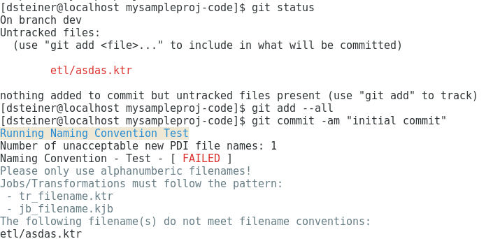

[INCLUDE=presentation]
Title         : Pentaho Standardised Git Repo Setup
Sub Title     : For Big Agile Teams
Author        : Diethard Steiner
Affiliation   : Bissol Consulting Ltd
Email         : diethard.steiner@bissolconsulting.com
Reveal Theme  : night
Beamer Theme  : singapore

[TITLE]

# Content

[TOC]

# Pentaho Standardised Git Repo Setup Presentation

## What is it go for?

- Enforces standardised git structure setup and naming conventions (to some extend)
- Being able to run it on multiple environments (but not necessarily in production)
- Out of Scope: Automatic Deployment (that's kind of the next step)
- Being able to run multiple projects next to each other in different simulated environments with the same OS user
- Multiple Projects sharing artefacts
- Doesn't require any special package to be installed. Uses bash scripts.

# Challenges

Normal PDI developer is not a code developer

Git is a strange thing: An alien

## Control the Chaos:

Developers will
- create different branches. Which one to deploy???
- use different file name conventions
- commit a whole lot of file types that shouldn't be there in the first place
- Which one is the main job to run?
- Teams will develop code over and over again => share the code 
=> Give them a starter package with predefined folder structure and git hooks to control names and file types that can be committed


# Artefacts

## PDI Store Types

- File based
- File Repo
- DB Repo
- EE Repo


## PDI Artefacts


| Name                        | Storage Type |
|-----------------------------|:------------:|
| `.kettle/kettle.properties` | all          |
| `.kettle/repositories.xml`  | repo         |
| `.kettle/shared.xml`        | file-based   |
| `.kettle/metastore`         | all          |
| `<pdi-repo>/<name>.kdb`     | repo         |
| `<name>.kjb`                | all          |
| `<name>.ktr`                | all          |


## Pentaho Server Artefacts

| Name               | File Extension | Store as is? |
|--------------------|:--------------:|:------------:|
| Mondrian Schema    | xml            | yes          |
| Metadata Model     | xmi (xml)      | yes          |
| Analyzer Report    | xanalyzer (xml) | yes          |
| Interactive Report | prpti (zip)    | NO?          |
| CDE                | cda, cdfde, wcdf, html, js, css, etc | yes      |
| DB Connection      | json?          | yes          |


# Solution

## Separating Config from Code

- Dedicated Git Repo per environment for configuration details
- Only one branch used: master

Give Me Code! Only Code!

## Using Project and Job specific properties files

- a generic wrapper available in `modules/master_wrapper/jb_master_wrapper.kjb`
- Sources the project and job specific properties files - no other subjob should source any properties files, or?! [OPEN] This might be a bit an issue since then you have to mention all the properties in any parent properties file ... unless you use the wrapper again to reference the sub-job - which you can't do, since PDI will error out.

## PDI: Externalise SQL

Easier to maintain - don't have to open Spoon to change it
Syntax highlighting in text editor
Any other goodies offered by text editor 

## Enforcing Standards via Git

Special thanks to Luis!

- Check for non ASCII filenames
- Check for jobs and transformations whose repository path does not match their filesystem path
- Check if filename meets naming conventions
- Check for unique file names
- Check if file type is in the list of accepted files [OPEN]

## Other Git Gems

- Generate Manifest: Allows you to see which version of code was added to a package (when you prepare code for deployment)
- Generate Changelog: Visiblity of what features, bug fixes etc were implemented in last built.


## Auto-Setup

The project includes an `initialse-repo.sh` which sets up the standardised **Git repo**.

###  Structure: Standalone Project (1)

- Create a standalone project with a PDI file repo - no shared artefacts:


```
./initialise-repo.sh -a 2 -p mysampleproj -e dev -s file-repo
```

### Structure: Standalone Project (2)

```
.
├── mysampleproj-code
│   ├── etl
│   │   ├── db_connection_template.kdb  <-- DB CONNECTION
│   │   └── modules                     <-- COMMON ETL PATTERNS
│   │       ├── continuous_delivery
│   │       └── master_wrapper
│   ├── .git
│   │   └── hooks
│   │       └── pre-commit              <-- COMMIT CHECKS 
│   ├── .gitmodules
│   ├── mdx
│   ├── mondrian-schemas
│   ├── pentaho-solutions
│   ├── README.md
│   └── sql
```

### Structure: Standalone Project (3)

```
├── mysampleproj-config-dev
│   ├── .git
│   │   └── hooks
│   │       └── pre-commit
│   ├── .kettle                                <-- KETTLE CONFIG
│   │   ├── kettle.properties
│   │   └── repositories.xml
│   ├── properties                             <-- PROJECT AND JOB CONFIG
│   │   ├── jb_mysampleproj_master.properties
│   │   └── mysampleproj.properties
│   ├── README.md
│   └── shell-scripts                          <-- STANDARDISED EXECUTION SCRIPTS
│       ├── run_jb_mysampleproj_master.sh
│       ├── set-env-variables.sh
│       └── wrapper.sh
└── mysampleproj-documentation
    └── README.md
```

### Repository

- Preconfigured access to file based **PDI repository**: After initialisation Developer can access the repo straight away from **Spoon**.
- The PDI repo is **preloaded** with centrally maintained **Modules**, to ensure **common design patterns** are followed.


- Just `source` the `set-env-variables.sh` file before starting **PDI Spoon**.

### Git Hooks

- Straight from the first commit checks will be run:



## Simulating Multiple Environments On One Machine

### Same Code Branch different Configs

Since we externalised the config details, we can just throw any config at the code:

```
myproject-code                <-- e.g. release_X branch checked out
myproject-config-integration  <-- config details for integration env
myproject-config-uat          <-- config details for uat env
```

### Mixing Different Code Branches

Simple: Just create parent folder and check out different code branches with different names, e.g.:

```
<parent-dir>/<project-name>/<branch-name>
<project-name>-config-<env1>
<project-name>-config-<env2>
```

# Git Branching

## Basic Strategy

Based on **GitFlow**:

featureX -> dev -> releaseX -> master

- feature branches: One for each new feature implemented
- dev branch: consolidates code for finished features
- release branches: One for each release
- master: holds latest production ready code

- Code gets propagated from featureX to master
- Developers can only access featureX and dev branches
- No changes on release and master branches!
- release codes run against integration tests first before being promoted

## Simple Merge Strategy

Since our code repo only contains code and we standardised the way code gets promoted the merge strategy is simple:

```
git merge <branch-to-merge-from
```
